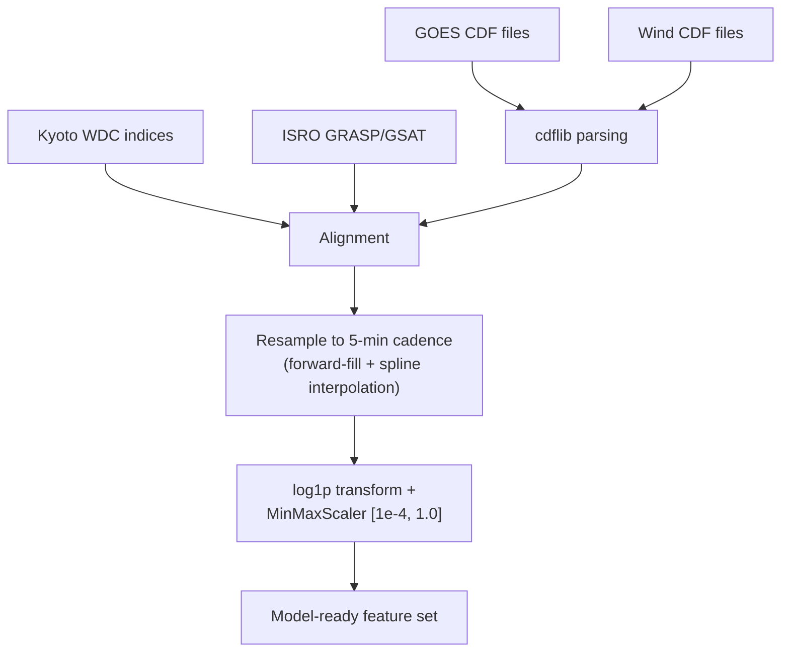
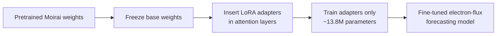
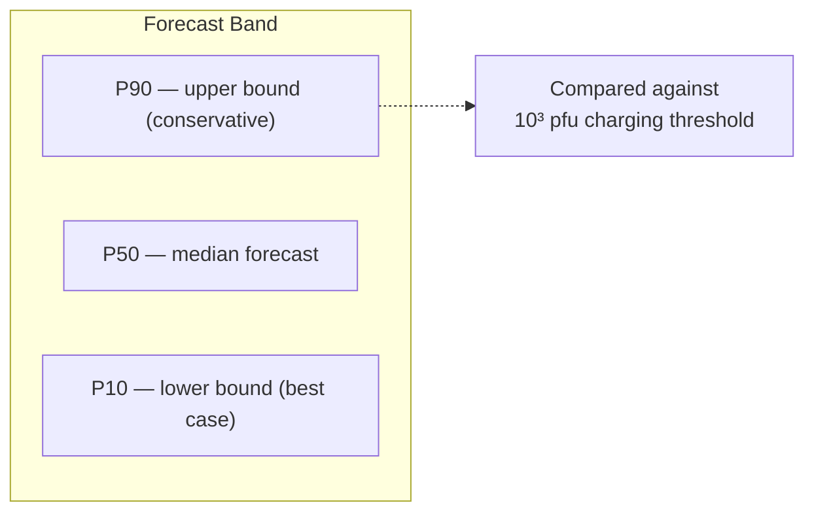
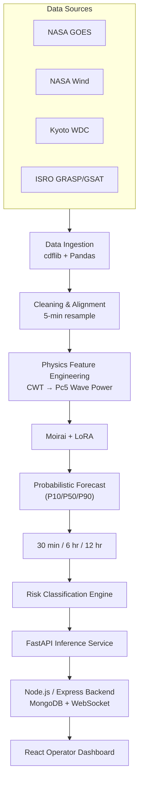
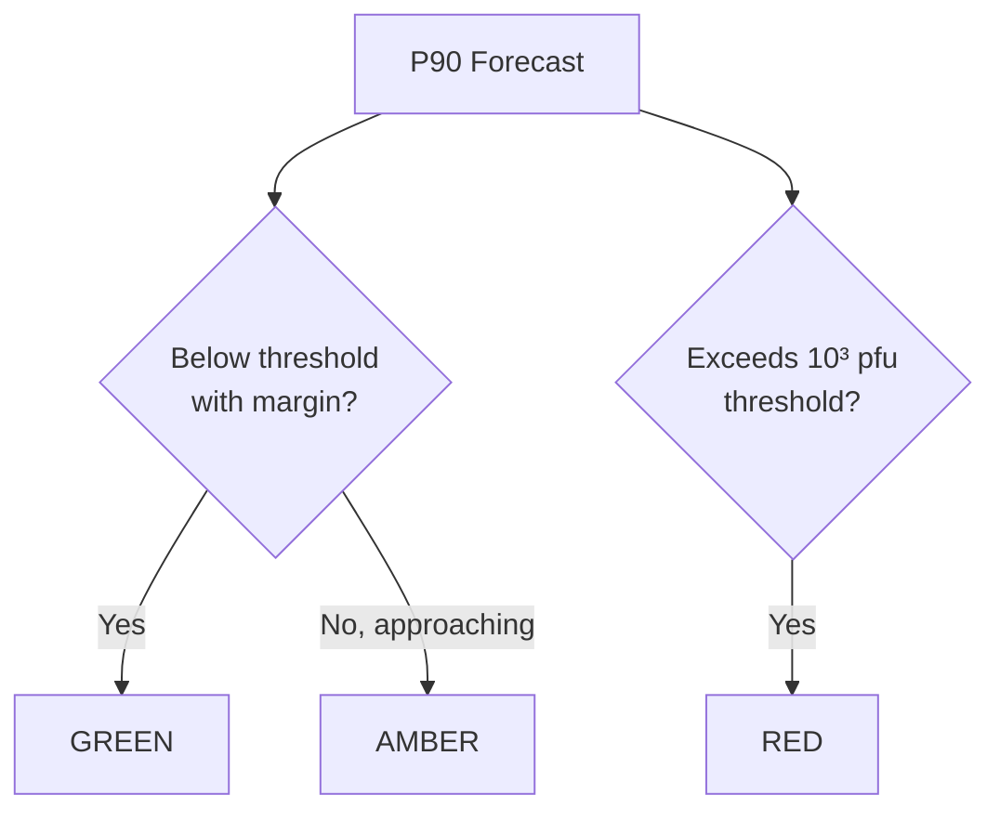

<div align="center">

# PRAHARI
### Predictive Radiation Hazard Alert & Resilience Intelligence

**A physics-informed deep learning system for forecasting relativistic electron flux at geostationary orbit**

<sub>Developed for ISRO Problem Statement 14 — Forecasting Energetic Particle Radiation Environment for ISRO's Geostationary Satellites</sub>

<br>


</div>

---

## Table of Contents

- [Problem at a Glance](#problem-at-a-glance)
- [PRAHARI at a Glance](#prahari-at-a-glance)
- [Why This Matters](#why-this-matters)
- [Data Sources](#data-sources)
- [Data Processing Pipeline](#data-processing-pipeline)
- [Physics-Informed Features](#physics-informed-features)
- [AI/ML Architecture](#aiml-architecture)
- [Forecast Output](#forecast-output)
- [Training Methodology & Results](#training-methodology--results)
- [System Architecture](#system-architecture)
- [Operator Dashboard](#operator-dashboard)
- [Technology Stack](#technology-stack)
- [Deployment](#deployment)
- [Limitations & Future Work](#limitations--future-work)
- [References](#references)

---

## Problem at a Glance

Geostationary satellites — including ISRO's INSAT and GSAT fleet — sit inside the outer Van Allen radiation belt, where solar storms can drive sudden spikes in relativistic (>2 MeV) electron flux. These "killer electrons" penetrate satellite shielding and embed in the dielectric material of circuit boards and cables. When the accumulated charge exceeds the material's breakdown strength, an internal electrostatic discharge (ESD) can damage or destroy onboard electronics.

ISRO's PS-14 asks for an algorithm that predicts >2 MeV electron flux at GEO **30–45 minutes**, **6 hours**, and **12 hours** ahead, using 11 years of GOES electron flux and Wind solar wind data.


PRAHARI is positioned upstream of this chain: it forecasts the electron flux enhancement before deep-dielectric charging accumulates to dangerous levels, giving operators a window to act.

---

## PRAHARI at a Glance

| Parameter | PRAHARI |
|---|---|
| Target variable | >2 MeV electron flux at GEO |
| Orbit regime | Geostationary (~6.6 R<sub>E</sub>) |
| Primary target data | NASA GOES (MAGED/EPEAD) |
| Upstream drivers | NASA Wind (SWE, MFI) |
| Geomagnetic indices | Kp, Dst, AE (Kyoto WDC) |
| Longitude calibration | ISRO GRASP / GSAT |
| Engineered physics feature | ULF Pc5 wave power (CWT) |
| Foundation model | Salesforce Moirai |
| Fine-tuning method | LoRA (13.8M trainable params) |
| Forecast horizons | 30 min · 6 hr · 12 hr |
| Output type | Probabilistic (P10 / P50 / P90) |
| Risk classification | Green / Amber / Red |
| Inference backend | FastAPI |
| Dashboard | React + Recharts |

---

## Why This Matters

Deep-dielectric charging has caused documented spacecraft anomalies in the past:

- **Galaxy 15 (2010)** — lost command control for months after a solar-storm-induced charging event, becoming a so-called "zombiesat."
- **Telesat Anik E1/E2 (1994)** — momentum wheel control failures traced to deep charging from energetic electrons, disrupting Canadian broadcast services.
- **Starlink (2022)** — a geomagnetic storm increased atmospheric drag and led to the loss of 40 newly launched satellites, illustrating how space weather can cause fleet-scale losses.

A single GEO satellite typically costs several hundred million dollars to build and launch. Existing operational forecasts (e.g., NOAA's relativistic electron models) largely rely on single-variable linear filtering and are tuned for US operating conditions. PRAHARI's goal is a forecasting approach tailored to the datasets ISRO specified, producing calibrated, multi-horizon, probabilistic output rather than a single point estimate.

---

## Data Sources

PRAHARI uses the four data sources specified in PS-14, spanning roughly a full solar cycle (11 years).

| Source | Instrument | Variables | Native Resolution | Role |
|---|---|---|---|---|
| NASA GOES (13/14/15/16) | MAGED / EPEAD | Integral electron flux, >2 MeV (particles/cm²/s/sr) | 5 min | Target variable |
| NASA Wind | SWE, MFI | Solar wind speed, proton density, IMF (B<sub>x</sub>, B<sub>y</sub>, B<sub>z</sub>) | 1 min | Upstream driver (Wind sits at L1, ~45–60 min ahead of Earth impact) |
| Kyoto World Data Center | — | Kp, Dst, AE indices | Varies (aligned) | Global geomagnetic state |
| ISRO GRASP / GSAT | — | Calibration data, 1–2 years | Project-specific | Indian-longitude (~74–93°E) bias correction |

<!-- INSERT: GEO orbit / Van Allen belt illustration -->

---

## Data Processing Pipeline

Raw CDF (Common Data Format) files from GOES and Wind contain gaps, recalibration artifacts, and mismatched sampling rates that need to be resolved before the data can be used for training.



**Key processing steps:**

- **CDF parsing** — `cdflib` is used to extract daily CDF files directly in Python, avoiding manual format conversion.
- **Resolution alignment** — GOES reports at 5-minute cadence and Wind at 1-minute cadence; all variables are resampled to a common 5-minute grid, using forward-fill for short gaps and spline interpolation for longer ones.
- **Scaling** — Electron flux values span roughly five orders of magnitude (10¹–10⁵). A `log1p` transform followed by `MinMaxScaler` bounded to `[1e-4, 1.0]` keeps values strictly positive and numerically stable for the downstream log-normal distribution head, avoiding NaN gradients during training.

---

## Physics-Informed Features

Rather than relying on the model to infer the relevant physical relationships from raw magnetic field data alone, several features are explicitly engineered from known space-physics mechanisms.

| Feature | Physical meaning | Role in forecasting |
|---|---|---|
| Solar wind speed (V<sub>sw</sub>) | Upstream driver strength | Storm intensity / context |
| IMF B<sub>z</sub> | Magnetic coupling orientation | Governs geomagnetic reconnection |
| Kp | Global geomagnetic activity | Overall magnetospheric disturbance state |
| Dst | Ring-current disturbance | Storm-phase indicator |
| AE | Auroral electrojet activity | Energy deposition in the magnetotail |
| Pc5 wave power | ULF radial-diffusion precursor | Precursor signal for electron acceleration |

### ULF Pc5 Wave Power

Outer-belt electrons gain relativistic energies partly through resonant interaction with Ultra-Low Frequency (Pc5) waves in the 1.5–10 mHz band. These waves are generated when solar wind pressure fluctuations perturb Earth's magnetic field, and they drive radial diffusion of electrons toward Earth, where the stronger field accelerates them:

$$D_{LL} = D_{LL}^{M} + D_{LL}^{E}$$

where $D_{LL}^{M}$ is the radial diffusion coefficient contribution from magnetic field fluctuations, and $D_{LL}^{E}$ is the corresponding contribution from electric field fluctuations. Because $D_{LL}^{M}$ depends strongly on ULF wave power, the magnitude of Pc5 activity is a useful precursor signal for subsequent electron acceleration.

**Why it matters:** Pc5 activity can build up before the corresponding flux enhancement is visible in the GOES measurements, so it carries early information the raw electron flux time series alone does not.

**PRAHARI implementation:** A Continuous Wavelet Transform (Morlet wavelet, via `PyWavelets`) is applied to the B<sub>z</sub> magnetometer series to isolate signal power in the 1.5–10 mHz band. Unlike an FFT, the CWT preserves time localization, allowing the onset of a Pc5 wave event to be identified. The resulting `Pc5_Wave_Power` series is fed into Moirai as a covariate alongside the other drivers.

---

## AI/ML Architecture

### Why a foundation model

| Requirement | LSTM / classical approach | Moirai |
|---|---|---|
| Long temporal context | Degrades over long sequences | Full-sequence self-attention |
| Multivariate covariates | Requires custom architecture per input set | Handles arbitrary covariate counts natively |
| Multiple forecast horizons | Typically trained separately per horizon | Single model, multiple horizons |
| Forecast output | Usually point estimate | Native probabilistic (distribution) output |

**Moirai** (Masked Encoder-based Universal Time Series Representation Learning, Salesforce AI Research) is a transformer-based foundation model pre-trained on the LOTSA time-series corpus. It represents input series as patches (tokens), similar in spirit to how BERT-style models tokenize text, which lets it condition forecasts on long historical context and an arbitrary number of covariates without architectural changes.

### Fine-tuning with LoRA

Fully fine-tuning a model the size of Moirai on 11 years of 5-minute-resolution data is computationally impractical outside a large GPU cluster. **LoRA (Low-Rank Adaptation)** freezes Moirai's pre-trained weights and injects small trainable rank-decomposition matrices into the attention layers.



This reduced the trainable parameter count to **13.8 million**, making it feasible to fine-tune on a single Apple Silicon (MPS) machine or a free-tier Colab/Kaggle T4 GPU in a few hours.

### Probabilistic output

Instead of a single-value prediction, the model head learns a mixture over several candidate distributions — Student-T, Normal, Log-Normal, and Negative Binomial — and weights them to match the empirical distribution of the electron flux target. From this, PRAHARI reports three quantiles:

- **P50 (median)** — central forecast
- **P90** — upper bound; used as the operational risk signal
- **P10** — lower bound

---

## Forecast Output



The three forecast horizons (30 min, 6 hr, 12 hr) are produced simultaneously by the same model for a given input window. Operationally, the **P90 band is the value monitored against the deep-dielectric charging threshold** (~10³ pfu, per Fennell et al. 2001): if P90 crosses this threshold, the corresponding risk level is escalated so an operator can review the forecast and decide on any protective action. PRAHARI itself does not initiate any automated satellite command.

---

## Training Methodology & Results

**Setup**

| Item | Value |
|---|---|
| Framework | PyTorch Lightning + `uni2ts` |
| Hardware | Apple Silicon (MPS) and NVIDIA T4 |
| Batch size | 32, with gradient clipping |
| Context length | 512 patches |
| Prediction length | 128 patches (~10.6 hours at 5-min resolution) |
| Loss | Packed Negative Log-Likelihood (NLL) |

**MPS training note:** During development, an MPS-specific issue in `aten::_standard_gamma` produced NaN gradients in the log-normal distribution head during Lightning's validation loop, halting training at epoch 0. This was addressed by strictly bounding inputs to `[1e-4, 1.0]` via the scaler (guaranteeing positivity before the log transform) and by disabling the validation loop on Mac (`limit_val_batches=0`), monitoring training NLL instead.

**Training loss (NLL) by epoch**

| Epoch | NLL Loss | Δ from previous |
|---:|---:|---:|
| 0 | 21.597 | — |
| 2 | 20.060 | −1.537 |
| 5 | 19.547 | −0.513 |
| 8 | 13.051 | −6.496 |
| 10 | 5.222 | −7.829 |

```mermaid
xychart-beta
    title "Training NLL Loss vs. Epoch"
    x-axis [0, 2, 5, 8, 10]
    y-axis "NLL Loss" 0 --> 25
    line [21.597, 20.060, 19.547, 13.051, 5.222]
```

The most significant drop occurs between epochs 5 and 8, after which loss continues to decrease through epoch 10. This pattern is consistent with the LoRA adapters converging on a useful representation of the relationship between the engineered covariates (notably Pc5 wave power and IMF B<sub>z</sub>) and the electron flux target, though it should be read as an indicator of fit to the training objective rather than a validated accuracy metric — see [Limitations](#limitations--future-work).

No RMSE, MAE, R², or classification-style accuracy metrics were computed for this submission; NLL on the training set is the only quantitative result reported here.

---

## System Architecture



**Risk classification logic**



<!-- INSERT: docs/images/system-architecture.png -->

---

## Operator Dashboard

The React frontend (Recharts + Tailwind) is intended to let an operator assess GEO radiation risk without needing to interpret raw flux numbers directly.

- Live and historical >2 MeV electron flux, plotted alongside the P10/P50/P90 forecast bands
- A marked line at the ~10³ pfu deep-dielectric charging threshold
- Per-satellite Green/Amber/Red risk indicator derived from the P90 forecast
- Selectable 30-min / 6-hr / 12-hr horizon views
- Visual alert state when the P90 band crosses the threshold, intended to prompt operator review

<!-- INSERT: docs/images/dashboard.png -->
<!-- INSERT: docs/images/forecast-example.png -->

---

## Technology Stack

**ML / Scientific computing**
Python · PyTorch · PyTorch Lightning · `uni2ts` · PyWavelets · Pandas · `cdflib`

**Backend**
FastAPI (inference service) · Node.js · Express

**Frontend**
React · Vite · TailwindCSS · Recharts

**Data**
GOES · Wind · Kyoto WDC · ISRO GRASP/GSAT

**Model**
Moirai (Salesforce) fine-tuned with LoRA

---

## Deployment

```text
Space Weather Data Feed
        ↓
Preprocessing Service (Python)
        ↓
Moirai Inference (FastAPI)
        ↓
Backend / WebSocket Layer (Node.js, MongoDB)
        ↓
Operator Dashboard (React)
```

- The fine-tuned Moirai (small variant) model runs inference for a 12-hour forecast in under 5 seconds on CPU in local testing, which is well within the 5-minute update cadence of the source data.
- The FastAPI service can be containerized and deployed on standard container platforms (e.g., Docker on Kubernetes/ECS/Cloud Run); this has not yet been exercised in an ISRO operational environment.
- MongoDB stores forecast and historical flux data as time-series JSON, enabling retrospective review of past storm periods.
- Because the base model is open-source and fine-tuned locally, the resulting adapter weights are fully owned by the team/organization running the pipeline, reducing reliance on external proprietary forecasting services for this specific task.

---

## Limitations & Future Work

- **Validation coverage** — Reported results are training-set NLL only; the model has not yet been evaluated on a held-out test set or benchmarked with standard forecast-accuracy metrics (RMSE, skill score, etc.) against historical storms.
- **Storm-event validation** — Performance during specific major historical geomagnetic storms has not yet been separately analyzed.
- **GRASP/GSAT calibration data** — Indian-longitude calibration currently uses 1–2 years of data; a longer calibration baseline would likely improve robustness of the longitude correction.
- **Operational deployment** — The architecture is designed to be deployable, but has not been integrated with or tested against ISRO's live operational infrastructure.
- **Uncertainty calibration** — The P10/P50/P90 quantiles are produced by the model's native distribution head; formal calibration checks (e.g., coverage analysis) have not yet been performed.
- **Automated response** — The system reports risk levels only; it does not issue or execute satellite commands.

Planned next steps include held-out and cross-storm validation, quantile calibration analysis, and testing the FastAPI service under a containerized deployment.

---

## References

1. Salesforce AI Research (2024). *Moirai: A Foundation Model for Universal Time Series Forecasting*. [arXiv:2402.02592](https://arxiv.org/abs/2402.02592)
2. Baker, D. N., et al. (1998). *Coronal mass ejections, magnetic clouds, and relativistic magnetospheric electron events: ISTP*. Journal of Geophysical Research: Space Physics, 103(A8), 17279–17291.
3. Elkington, S. R., Hudson, M. K., & Chan, A. A. (2003). *Resonant acceleration and radial diffusion of outer zone electrons in an asymmetric geomagnetic field*. Physics of Plasmas, 10(11), 4627–4638.
4. Rostoker, G., Skone, S., & Baker, D. N. (1998). *On the origin of relativistic electrons in the magnetosphere associated with some geomagnetic storms*. Geophysical Research Letters, 25(19), 3701–3704.
5. Fennell, J. F., et al. (2001). *Deep dielectric charging: Satellite anomalies and space weather*. IEEE Transactions on Plasma Science.
6. Hu, E. J., et al. (2021). *LoRA: Low-Rank Adaptation of Large Language Models*. [arXiv:2106.09685](https://arxiv.org/abs/2106.09685)
7. O'Brien, T. P., et al. (2001). *Which magnetic storms produce relativistic electrons at geosynchronous orbit?* Journal of Geophysical Research.
8. Reeves, G. D., et al. (2003). *Acceleration and loss of relativistic electrons during geomagnetic storms*. Geophysical Research Letters, 30(10).
9. Camporeale, E. (2019). *The challenge of machine learning in space weather: Nowcasting and forecasting*. Space Weather, 17(8), 1166–1207.
10. ISRO Problem Statement 14 (2024). *Forecasting Energetic Particle Radiation Environment for ISRO's Geostationary Satellites*. ISRO Hackathon Official Documentation.

---

<div align="center">
<sub>Team PRAHARI — ISRO Hackathon submission for Problem Statement 14</sub>
</div>
